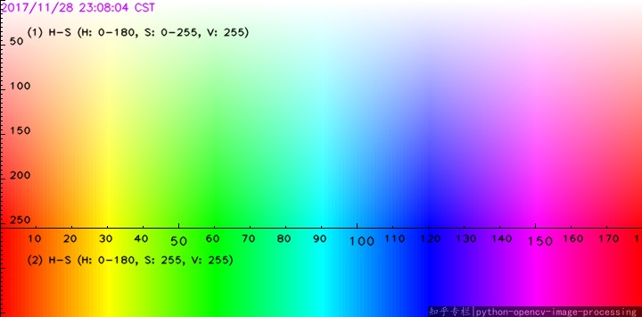
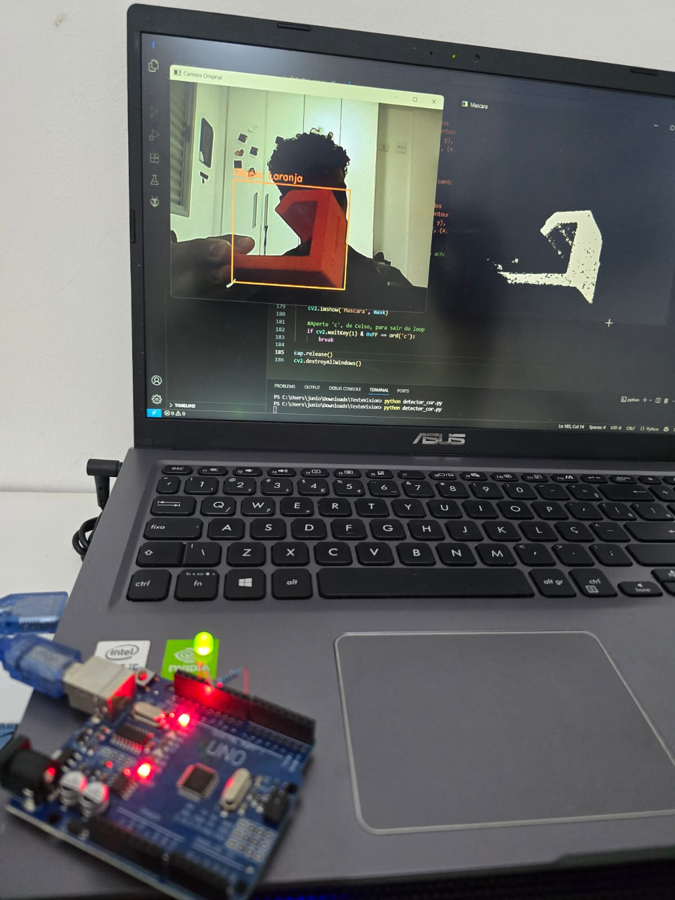

# Detector de Cores com Visão Computacional (OpenCV)

Este projeto utiliza Python e a biblioteca OpenCV para detectar e rastrear cores em tempo real utilizando a webcam. O algoritmo converte as imagens para o espaço de cores HSV (Hue, Saturation, Value), o que garante uma detecção muito mais precisa e resistente a variações de iluminação do ambiente.

---

## Como testar na sua máquina

### Passo 1: Instale o Python (Se você ainda não tiver)
No Windows:
Baixe o instalador oficial em python.org/downloads.
Abra o instalador e, MUITO IMPORTANTE: Na primeira tela, antes de clicar em instalar, marque a caixinha "Add python.exe to PATH" (fica no rodapé da janela). Isso evita erros no terminal mais para frente!
Conclua a instalação.

No Linux:
_sudo apt update_
_sudo apt install python3 python3-pip_

### Passo 2: Instale as Bibliotecas Necessárias
_pip install opencv-python numpy_
_pip install pyserial_

### Passo 3: Edite o código para escolher a cor de detecção (retire os comentarios)
Caso queira ajustar a detecção de cores, use a tabela abaixo e edite a variavel "lower" e "upper" da cor desejada

### Passo 4: Rode o programa em Python e o C++ na IDE do arduino
_python detector_cor.py_

⚠️ Atenção (Usuários de Windows 11): Se o script rodar sem erros no terminal, mas a câmera não abrir, vá em Configurações > Privacidade e segurança > Câmera e certifique-se de que a permissão de acesso à câmera está ativada para aplicativos da área de trabalho.
Obs: Não mantenha o serial monitor aberto enquanto roda o programa .py

Aperte "c" para fechar!

